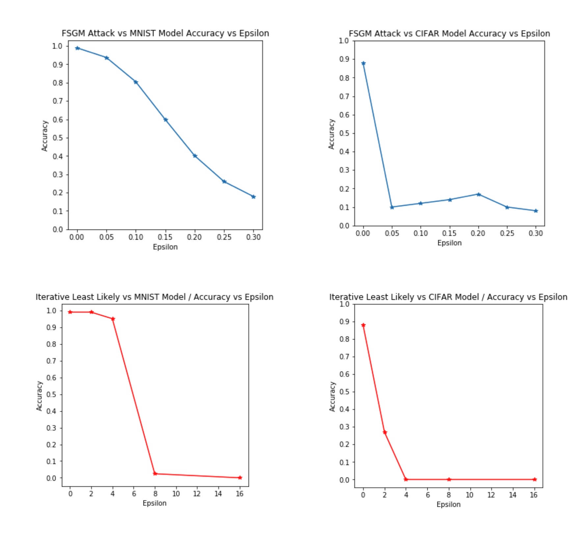
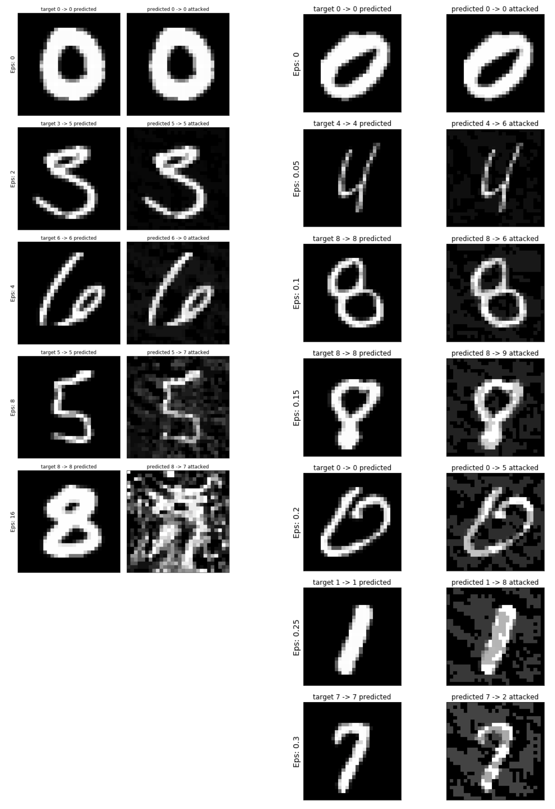
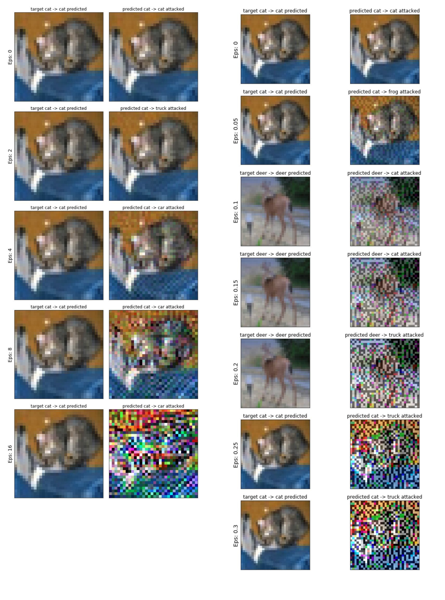

# Adversarial Attacks Example in Pytorch

This repository contains a sample PyTorch implementation of adversarial attacks.

It contains different types of adversarial attack methods:

* Fast Sign Gradient Method
* Iterative Least Likely Method
* Other Attacks like PGD, AutoAttack, BIM, CW

It trains and then attacks two different neural net models:

* a LeNet model trained on the MNIST dataset (98%+ accuracy)
* a DenseNet model trained on the CIFAR10 dataset (appx. 90% accuracy)


## Table of Contents

1. [Requirements and Installation](#Requirements-and-Installation)
2. [Plots](#Performance-Comparison)
3. [Code](#Code)
4. [Other Attacks](#Other-Attacks)
5. [References](#Recommended-Sites-and-Packages)

## Requirements and Installation

```
pip install torch
pip install torchvision
```

### Installation from source (recommended)

```
pip install git+https://github.com:VaruniBuereddy/AdversarialAttacks.git
```

or

```
git clone https://github.com/VaruniBuereddy/AdversarialAttacks.git
cd AdversarialAttacks
pip install -e .
```

## Plots



## LeNet MNist Attack Examples



## DenseNet CIFAR Attack Examples




## Code

See the included Jupyter Notebook (`adversarial_attacks.ipynb`) for the implementation.

## Other Attacks 
There are many attacks like the PGD, CW, AutoAttack etc. For more details please have a look at the folder "[attacks]"(https://github.com/VaruniBuereddy/AdversarialAttacks/attacks)

## References

[1]  Ian Goodfellow, Jonathon Shlens, and Christian Szegedy. Explaining and harnessing adversarial examples. In International Conference on Learning Representations, 2015.

[2]  Kaiming He, Xiangyu Zhang, Shaoqing Ren, and Jian Sun. Deep residual learning for image recognition. CoRR, abs/1512.03385, 2015.

[3]  Gao Huang, Zhuang Liu, Laurens van der Maaten, and Kilian Q. Weinberger. Densely connected convolutional networks. 2017 IEEE Conference on Computer Vision and Pattern Recognition (CVPR), pages 2261–2269, 2017.

[4]  Alexey Kurakin, Ian J. Goodfellow, and Samy Bengio. Adversarial machine learning at scale.CoRR, abs/1611.01236, 2016.

[5]  Seyed-Mohsen Moosavi-Dezfooli, Alhussein Fawzi, and Pascal Frossard. Deepfool: A simple and accurate method to fool deep neural networks. In CVPR, pages 2574–2582. IEEE Computer Society, 2016.

[6]  Christian Szegedy, Wojciech Zaremba, Ilya Sutskever, Joan Bruna, Dumitru Erhan, Ian J. Goodfellow, and Rob Fergus. Intriguing properties of neural networks. CoRR, abs/1312.6199, 2013.

[7] Sergey Zagoruyko and Nikos Komodakis. Wide residual networks. CoRR, abs/1605.07146, 2016.

[8] [PyTorch FGSM Tutorial](https://pytorch.org/tutorials/beginner/fgsm_tutorial.html)

